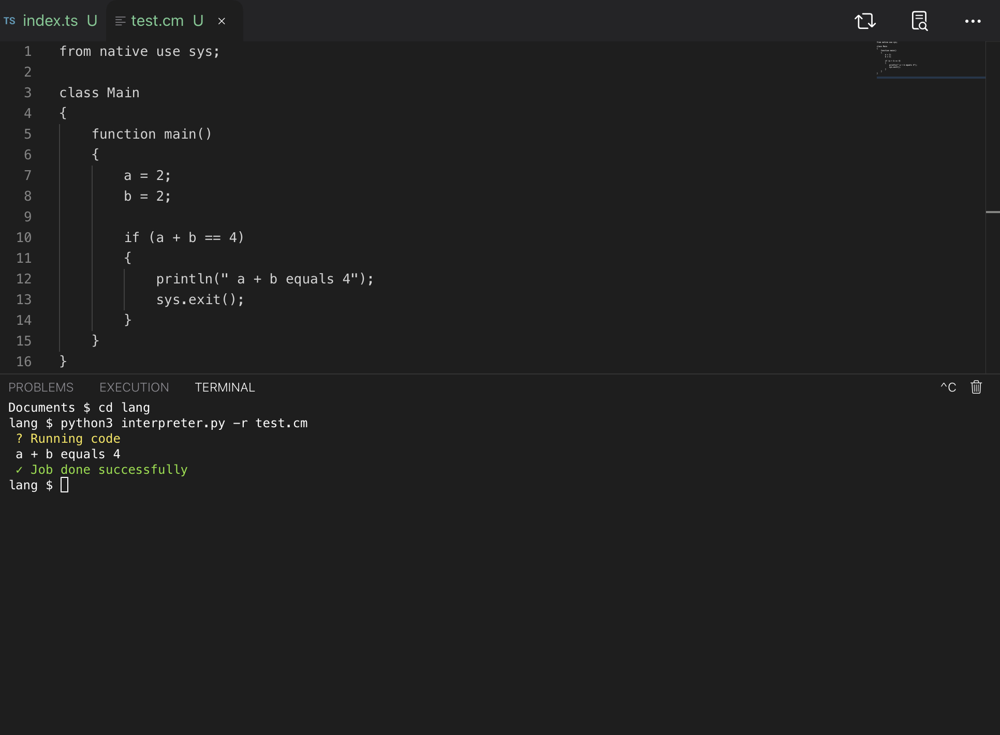

</img>


 

   

</img>
# C-
The C- programming language version 0.3.5

## Why
C- is a language heavily inspired by C++, python, and java, but simpler.

# Why should you use it
Tired of C? Use ***C-***!

## Get Started
> git clone https://github.com/Rayan25062011/C-
> 
> chmod +x src
> 
> cd src
> 
> python3 interpreter.py -r example.cm

Or simply available with <a href="https://github.com/Rayan25062011/cmp">cmp</a>

###### examples
```cm

class Main
{
    function main()
    {
        println("Hello from C-!");
    }
}

```

## !!!NOTICE!!!
***EVERY C- file needs to implement a CLASS "Main" to wrap up the code.***

###### Goals
<sub> 

1. Make a package manager

2. Make it famous

3. Make Github add this programming language
</sub>

## FAQ
C- was first released on the ***28th January 2023*** and since then, we kept updating for user's to enjoy and use the language very easily, we keep track of the repository 4 times a day to make a sure you are a having an appreciatable time while coding with our language. C- has the soul purpose to help you with automation, software, server creation and all kinds of cyber-security.

</img>
